# CodeAtlas Architecture

## C4 Model

> **Note:** The C4 diagrams below use Mermaid's C4 syntax. If your MkDocs setup doesn't support C4 diagrams, you may need to install the `mermaid-c4` plugin or use the alternative diagrams provided in the sections below.

### Level 1: System Context

### Level 2: Container Diagram

### Level 3: Component Diagram - Documentation Generator

### Level 3: Component Diagram - Repository Manager

### Deployment Diagram

### Alternative C4 Diagrams (Standard Mermaid)

If C4-specific syntax isn't supported, here are alternative diagrams using standard Mermaid:

#### System Context (Alternative)

```mermaid
graph TB
    subgraph "External Systems"
        Developer[👤 Developer]
        GitHub[🐙 GitHub<br/>Repository Hosting]
        Ollama[🤖 Ollama<br/>LLM Server]
    end
    
    subgraph "CodeAtlas System"
        CodeAtlas[CodeAtlas<br/>Documentation Generator]
    end
    
    Developer -->|"Runs CLI or triggers"| CodeAtlas
    CodeAtlas -->|"Fork/clone repos<br/>Create PRs"| GitHub
    CodeAtlas -->|"Generate documentation"| Ollama
    
    style CodeAtlas fill:#4a90e2,stroke:#2e5c8a,color:#fff
    style Developer fill:#e8f4f8
    style GitHub fill:#e8f4f8
    style Ollama fill:#e8f4f8
```

#### Container Diagram (Alternative)

## Class Diagram

## Component Flow Diagram

## Module Dependencies

